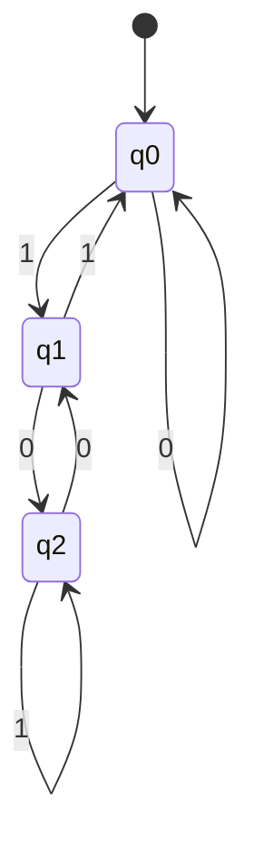
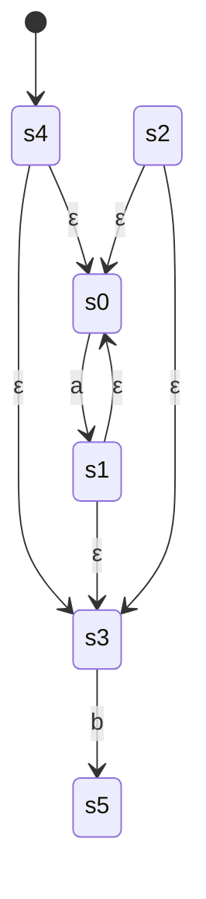
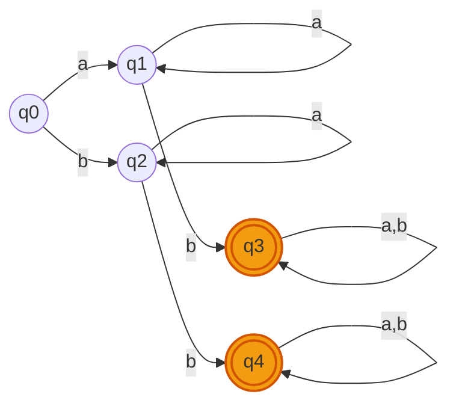
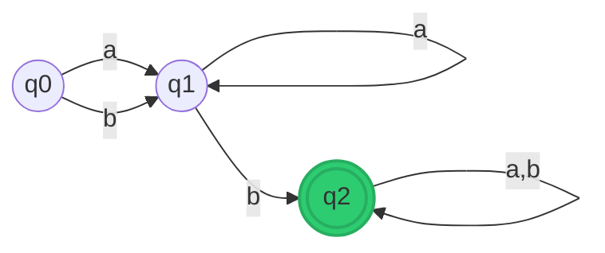

# Laporan Proyek Teori Bahasa dan Automata (TBA)
## Aplikasi Smart Automata Simulator

Laporan ini menyajikan struktur dokumentasi formal, penjelasan implementasi kode program, serta contoh masukan (input) dan luaran (output) dari empat fitur utama yang diimplementasikan pada aplikasi **Smart Automata Simulator**.

---

## DAFTAR ISI
1. [Fitur 1: Uji String pada Deterministic Finite Automata (DFA)](#fitur-1-uji-string-pada-deterministic-finite-automata-dfa)
2. [Fitur 2: Konversi Regular Expression ke NFA (Konstruksi Thompson) & Uji String](#fitur-2-konversi-regular-expression-ke-nfa-konstruksi-thompson--uji-string)
3. [Fitur 3: Minimisasi DFA (Partition Refinement)](#fitur-3-minimisasi-dfa-partition-refinement)
4. [Fitur 4: Cek Ekuivalensi Dua DFA (Product Construction + BFS)](#fitur-4-cek-ekuivalensi-dua-dfa-product-construction--bfs)

---

## Fitur 1: Uji String pada Deterministic Finite Automata (DFA)

### 1.1 Deskripsi & Teori
Fitur ini memvalidasi apakah sebuah string masukan diterima atau ditolak oleh mesin DFA yang didefinisikan oleh pengguna. Mesin menelusuri transisi secara sekuensial karakter demi karakter mulai dari *start state*.

### 1.2 Format Masukan (Input)
*   **States**: `q0, q1, q2`
*   **Alfabet**: `0, 1`
*   **Start State**: `q0`
*   **Accepting States**: `q2`
*   **Tabel Transisi**:
    ```text
    q0, 0, q0
    q0, 1, q1
    q1, 0, q2
    q1, 1, q0
    q2, 0, q1
    q2, 1, q2
    ```
*   **String Uji**: `010`

### 1.3 Representasi Graf Automata


### 1.4 Hasil Luaran (Output)
*   **Status**: `✅ DITERIMA (Accepted)`
*   **Lintasan State (Trace)**:
    $$\text{Start } (q0) \xrightarrow{0} q0 \xrightarrow{1} q1 \xrightarrow{0} q2 \quad (\text{Accepting State})$$
*   **Log Simulasi**:
    | Langkah | Karakter Dibaca | State Aktif | Sisa String |
    | :--- | :---: | :---: | :---: |
    | 0 | — | `q0` | `010` |
    | 1 | `0` | `q0` | `10` |
    | 2 | `1` | `q1` | `0` |
    | 3 | `0` | `q2` | (selesai) |

### 1.5 Implementasi Kode
Logika pemrosesan DFA diimplementasikan pada kelas `DFA` dalam file **[engine.py](file:///d:/Nia/Kuliah/SEM4/TBA/engine.py#L18-L49)**:

```python
class DFA:
    def __init__(self, states, alphabet, transitions, start, accepts):
        self.states = set(states)
        self.alphabet = set(alphabet)
        self.transitions = dict(transitions)
        self.start = start
        self.accepts = set(accepts)

    def run(self, string):
        current = self.start
        trace = [current]
        for ch in string:
            if ch not in self.alphabet:
                return False, trace
            key = (current, ch)
            if key not in self.transitions:
                return False, trace
            current = self.transitions[key]
            trace.append(current)
        return (current in self.accepts), trace
```
**Penjelasan Kode:**
1.  **Konstruktor (`__init__`)**: Menyimpan komponen DFA berupa himpunan state (`states`), alfabet (`alphabet`), fungsi transisi (`transitions` dalam bentuk dictionary Python dengan kunci `(state, simbol)`), start state, dan himpunan accepting states.
2.  **Pencocokan String (`run`)**: Dimulai dari `self.start` sebagai state aktif. Untuk setiap karakter dalam string, dicocokkan dengan dictionary `self.transitions`. Jika transisi valid, state aktif diperbarui dan ditambahkan ke dalam `trace` untuk kebutuhan visualisasi lintasan pada frontend. Jika di akhir pembacaan string, state aktif berada di `accepts`, maka fungsi mengembalikan nilai `True`.

---

## Fitur 2: Konversi Regular Expression ke NFA (Konstruksi Thompson) & Uji String

### 2.1 Deskripsi & Teori
Mengubah ekspresi reguler (Regex) menjadi *Nondeterministic Finite Automata with Epsilon Transitions* ($\varepsilon$-NFA) menggunakan **Konstruksi Thompson**. Evaluasi string pada NFA menggunakan metode **$\varepsilon$-closure** untuk melacak pergerakan state secara paralel.

### 2.2 Format Masukan (Input)
*   **Regular Expression**: `a*b`
*   **String Uji**: `aab`

### 2.3 Hasil Pembangkitan NFA (Konstruksi Thompson)
Berdasarkan AST dari ekspresi `a*b`, NFA yang di-generate memiliki struktur sebagai berikut:



### 2.4 Hasil Luaran (Output)
*   **Spesifikasi Mesin NFA**:
    *   **States**: `['s0', 's1', 's2', 's3', 's4', 's5']`
    *   **Start State**: `s4`
    *   **Accepting State**: `s5`
*   **Status Pengujian**: `✅ DITERIMA (Accepted)`
*   **Trace Himpunan State (Parallel Tracking)**:
    | Langkah | Karakter Dibaca | Himpunan State Aktif (termasuk $\varepsilon$-closure) |
    | :--- | :---: | :--- |
    | 0 | *Start* | `['s0', 's1', 's3', 's4']` |
    | 1 | `a` | `['s0', 's1', 's3']` |
    | 2 | `a` | `['s0', 's1', 's3']` |
    | 3 | `b` | `['s5']` (Mengandung accepting state `s5`) |

### 2.5 Implementasi Kode
Parser regex dan konstruksi NFA Thompson diimplementasikan melalui kelas `RegexParser` dan `NFA` di file **[engine.py](file:///d:/Nia/Kuliah/SEM4/TBA/engine.py#L55-L255)**:

#### A. Konstruksi Thompson (`RegexParser` & `to_nfa`)
```python
def build(node):
    kind = node[0]
    if kind == 'symbol':
        s, t = self.new_state(), self.new_state()
        add_trans(s, node[1], t)
        return s, t
    elif kind == 'epsilon':
        s, t = self.new_state(), self.new_state()
        add_trans(s, EPSILON, t)
        return s, t
    elif kind == 'concat':
        s1, t1 = build(node[1])
        s2, t2 = build(node[2])
        add_trans(t1, EPSILON, s2)
        return s1, t2
    elif kind == 'union':
        s1, t1 = build(node[1])
        s2, t2 = build(node[2])
        s, t = self.new_state(), self.new_state()
        add_trans(s, EPSILON, s1)
        add_trans(s, EPSILON, s2)
        add_trans(t1, EPSILON, t)
        add_trans(t2, EPSILON, t)
        return s, t
    elif kind == 'star':
        s1, t1 = build(node[1])
        s, t = self.new_state(), self.new_state()
        add_trans(s, EPSILON, s1)
        add_trans(t1, EPSILON, t)
        add_trans(s, EPSILON, t)
        add_trans(t1, EPSILON, s1)
        return s, t
```
**Penjelasan Konstruksi:**
Fungsi `build(node)` membaca AST hasil parsing regex secara rekursif:
*   **Symbol/Epsilon**: Membuat dua state baru dan menghubungkannya dengan transisi simbol atau epsilon ($\varepsilon$).
*   **Concat**: Menghubungkan state penerima sub-NFA pertama dengan state awal sub-NFA kedua menggunakan transisi $\varepsilon$.
*   **Union (`|`)**: Membuat jalur paralel dari state awal baru ke kedua sub-NFA menggunakan $\varepsilon$, lalu menggabungkan kedua state akhirnya ke state akhir baru.
*   **Kleene Star (`*`)**: Menyediakan jalur perulangan kembali ($\varepsilon$ dari akhir ke awal sub-NFA) serta jalur bypass langsung (dari start baru ke end baru).

#### B. Simulasi NFA (`NFA`)
```python
class NFA:
    # ... init ...
    def epsilon_closure(self, states):
        stack = list(states)
        closure = set(states)
        while stack:
            s = stack.pop()
            for t in self.transitions.get((s, EPSILON), set()):
                if t not in closure:
                    closure.add(t)
                    stack.append(t)
        return frozenset(closure)

    def run(self, string):
        current = self.epsilon_closure({self.start})
        trace = [current]
        for ch in string:
            nxt = set()
            for s in current:
                for t in self.transitions.get((s, ch), set()):
                    nxt.add(t)
            current = self.epsilon_closure(nxt)
            trace.append(current)
            if not current:
                return False, trace
        accepted = any(s in self.accepts for s in current)
        return accepted, trace
```
**Penjelasan Simulasi:**
1.  **`epsilon_closure`**: Menghitung kumpulan state yang dapat dicapai dari sekumpulan state dasar hanya dengan menelusuri transisi $\varepsilon$ (DFS/BFS internal).
2.  **`run`**: Menelusuri string dengan melacak kumpulan state aktif secara paralel. Setiap membaca simbol baru, program mencari semua state tujuan dari seluruh state aktif saat ini, kemudian menghitung penutupan epsilon (`epsilon_closure`) dari himpunan state baru tersebut.

---

## Fitur 3: Minimisasi DFA (Partition Refinement)

### 3.1 Deskripsi & Teori
Mereduksi jumlah state pada DFA agar menghasilkan mesin yang paling efisien dengan bahasa yang sama menggunakan algoritma **Partition Refinement** (Table-Filling).

### 3.2 Format Masukan (Input)
*   **States**: `q0, q1, q2, q3, q4`
*   **Alfabet**: `a, b`
*   **Start State**: `q0`
*   **Accepting States**: `q3, q4`
*   **Tabel Transisi**:
    ```text
    q0, a, q1
    q0, b, q2
    q1, a, q1
    q1, b, q3
    q2, a, q2
    q2, b, q4
    q3, a, q3
    q3, b, q3
    q4, a, q4
    q4, b, q4
    ```

### 3.3 Proses Partisi (Refinement)
1.  **Partisi Awal ($P_0$)**: 
    *   Kelompok Penerima ($G_1$): `{q3, q4}`
    *   Kelompok Non-Penerima ($G_2$): `{q0, q1, q2}`
2.  **Iterasi 1 ($P_1$)**:
    *   Uji transisi kelompok $G_2$:
        *   `q0` membaca `a` $\rightarrow$ `q1` (di $G_2$), membaca `b` $\rightarrow$ `q2` (di $G_2$)
        *   `q1` membaca `a` $\rightarrow$ `q1` (di $G_2$), membaca `b` $\rightarrow$ `q3` (di $G_1$)
        *   `q2` membaca `a` $\rightarrow$ `q2` (di $G_2$), membaca `b` $\rightarrow$ `q4` (di $G_1$)
    *   Karena transisi `q0` berbeda dengan `q1` dan `q2`, kelompok $G_2$ terpecah menjadi:
        *   `{q0}`
        *   `{q1, q2}`
    *   Uji transisi kelompok $G_1$: keduanya tetap berada di $G_1$.
3.  **Partisi Akhir ($P_{\text{final}}$)**: `{q0}`, `{q1, q2}`, `{q3, q4}`.

### 3.4 Perbandingan Graf Automata

```carousel

<!-- slide -->

```

### 3.5 Hasil Luaran (Output)
*   **Metrik Reduksi**:
    *   Jumlah State Awal: `5`
    *   Jumlah State Minimal: `3`
    *   Pengurangan: `2 State`
*   **Definisi DFA Minimal**:
    *   **States**: `['q0', 'q1', 'q2']` (dimana `q1` mewakili `{q1, q2}` dan `q2` mewakili `{q3, q4}`)
    *   **Start State**: `q0`
    *   **Accepting State**: `q2`
    *   **Transisi DFA Minimal**:
        ```text
        (q0, a) -> q1
        (q0, b) -> q1
        (q1, a) -> q1
        (q1, b) -> q2
        (q2, a) -> q2
        (q2, b) -> q2
        ```

### 3.6 Implementasi Kode
Algoritma minimisasi diimplementasikan dalam fungsi `minimize_dfa` pada file **[engine.py](file:///d:/Nia/Kuliah/SEM4/TBA/engine.py#L261-L327)**:

```python
def minimize_dfa(dfa: DFA):
    states = sorted(dfa.states)
    alphabet = sorted(dfa.alphabet)

    # 1. Hapus state yang tidak reachable
    reachable = {dfa.start}
    frontier = [dfa.start]
    while frontier:
        s = frontier.pop()
        for a in alphabet:
            t = dfa.transitions.get((s, a))
            if t is not None and t not in reachable:
                reachable.add(t)
                frontier.append(t)
    states = [s for s in states if s in reachable]

    # 2. Partisi awal: accepting vs non-accepting
    accept_set = frozenset(s for s in states if s in dfa.accepts)
    nonaccept_set = frozenset(s for s in states if s not in dfa.accepts)
    partitions = [p for p in [accept_set, nonaccept_set] if p]

    def find_group(state, groups):
        for g in groups:
            if state in g:
                return g
        return None

    # 3. Refinement loop
    changed = True
    while changed:
        changed = False
        new_partitions = []
        for group in partitions:
            splitter = {}
            for s in group:
                signature = tuple(
                    find_group(dfa.transitions.get((s, a)), partitions)
                    for a in alphabet
                )
                splitter.setdefault(signature, set()).add(s)

            if len(splitter) == 1:
                new_partitions.append(group)
            else:
                changed = True
                for sub in splitter.values():
                    new_partitions.append(frozenset(sub))
        partitions = new_partitions

    # 4. Bangun DFA baru berdasarkan kelompok partisi
    group_name = {g: f"q{i}" for i, g in enumerate(partitions)}
    # ... penyusunan transisi baru ...
    return DFA(set(group_name.values()), dfa.alphabet, new_transitions, new_start, new_accepts)
```
**Penjelasan Kode:**
1.  **Langkah 1**: Menghilangkan state yang tidak dapat dicapai dari start state menggunakan algoritma BFS sederhana.
2.  **Langkah 2**: Membagi state-state reachable menjadi dua partisi utama: accepting vs non-accepting.
3.  **Langkah 3**: Loop pembagian (refinement) menggunakan tanda tangan transisi (`signature`). Tanda tangan ini merepresentasikan ke kelompok mana suatu state berpindah untuk setiap simbol input. Jika state-state dalam satu kelompok memiliki tanda tangan yang berbeda, kelompok tersebut dipecah.
4.  **Langkah 4**: Mengonversi setiap kelompok partisi akhir yang stabil menjadi state minimal baru dan menyusun ulang tabel transisi.

---

## Fitur 4: Cek Ekuivalensi Dua DFA (Product Construction + BFS)

### 4.1 Deskripsi & Teori
Menentukan apakah dua DFA menerima bahasa yang **persis sama** menggunakan **Product Construction (Cross-Product)** yang ditelusuri dengan pencarian melebar (**BFS**). Jika ditemukan pasangan state $(s_1, s_2)$ di mana salah satunya menerima sedangkan yang lain menolak, maka kedua DFA dinyatakan tidak ekuivalen dan string tersebut dikembalikan sebagai bukti (*Distinguishing String*).

### 4.2 Format Masukan (Input)

#### DFA 1
*   **States**: `q0, q1`
*   **Alfabet**: `a, b`
*   **Start**: `q0`
*   **Accepting**: `q1`
*   **Transisi DFA 1**:
    ```text
    q0, a, q1
    q0, b, q0
    q1, a, q1
    q1, b, q0
    ```

#### DFA 2
*   **States**: `p0, p1, p2`
*   **Alfabet**: `a, b`
*   **Start**: `p0`
*   **Accepting**: `p1, p2`
*   **Transisi DFA 2**:
    ```text
    p0, a, p1
    p0, b, p0
    p1, a, p2
    p1, b, p0
    p2, a, p2
    p2, b, p0
    ```

### 4.3 Hasil Luaran (Output)
*   **Status Ekuivalensi**: `✅ EKUIVALEN (Equivalent)`
*   **Analisis**:
    Kedua DFA menerima bahasa yang direpresentasikan oleh regular expression `b*a(a|b)*`. Karena setiap pasangan state yang dapat dicapai dari $(q_0, p_0)$ selalu memiliki sifat penerimaan yang setara (misalnya $(q_1, p_1)$ dan $(q_1, p_2)$ keduanya bernilai *True* untuk penerimaan), maka kedua mesin tersebut terbukti ekuivalen secara fungsional.

### 4.4 Implementasi Kode
Algoritma pemeriksaan ekuivalensi diimplementasikan dalam fungsi `dfa_equivalent` pada file **[engine.py](file:///d:/Nia/Kuliah/SEM4/TBA/engine.py#L334-L365)**:

```python
def dfa_equivalent(dfa1: DFA, dfa2: DFA):
    alphabet = sorted(dfa1.alphabet | dfa2.alphabet)
    DEAD = "__DEAD__"

    def step(dfa, state, symbol):
        if state == DEAD:
            return DEAD
        return dfa.transitions.get((state, symbol), DEAD)

    def is_accept(dfa, state):
        return state != DEAD and state in dfa.accepts

    queue = [(dfa1.start, dfa2.start, "")]
    visited = {(dfa1.start, dfa2.start)}

    while queue:
        s1, s2, path = queue.pop(0)
        # Jika satu state bernilai accept dan pasangannya tidak, maka TIDAK EKUIVALEN
        if is_accept(dfa1, s1) != is_accept(dfa2, s2):
            return False, (path if path != "" else "(string kosong / epsilon)")
        
        for sym in alphabet:
            n1 = step(dfa1, s1, sym)
            n2 = step(dfa2, s2, sym)
            pair = (n1, n2)
            if pair not in visited:
                visited.add(pair)
                queue.append((n1, n2, path + sym))

    return True, None
```
**Penjelasan Kode:**
1.  **Product States & BFS**: Algoritma memeriksa pasangan state gabungan `(s1, s2)` mulai dari start state kedua DFA. Penelusuran menggunakan struktur BFS untuk menemukan string pembeda terpendek.
2.  **State Mati (`DEAD`)**: Ditambahkan untuk menangani kasus di mana transisi tidak didefinisikan secara lengkap pada DFA masukan (DFA parsial), sehingga transisinya mengarah ke state perangkap virtual.
3.  **Pendeteksian Perbedaan**: Jika di suatu pasangan state `(s1, s2)` yang dicapai oleh lintasan `path` memiliki status penerimaan berbeda (`is_accept` bernilai `True` pada satu DFA dan `False` pada DFA lainnya), fungsi langsung berhenti dan mengembalikan string pembeda tersebut. Jika antrean kosong tanpa menemukan perbedaan, kedua DFA terbukti ekuivalen.

---
*Laporan ini di-generate secara otomatis untuk mendokumentasikan fungsionalitas utama Smart Automata Simulator.*
