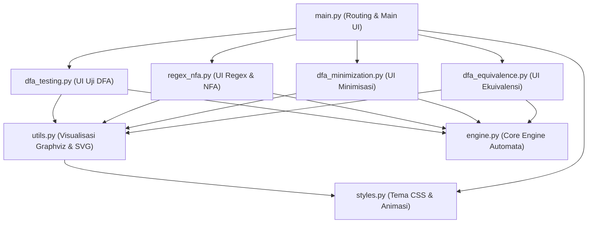
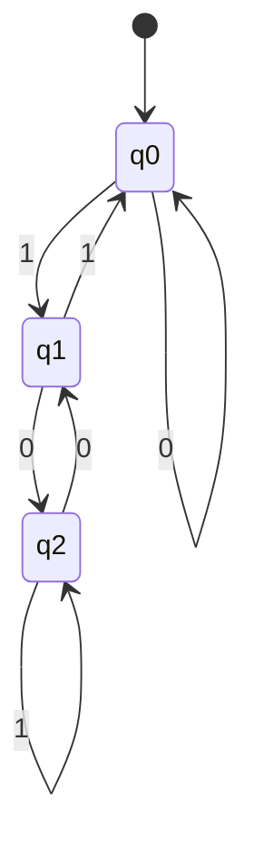
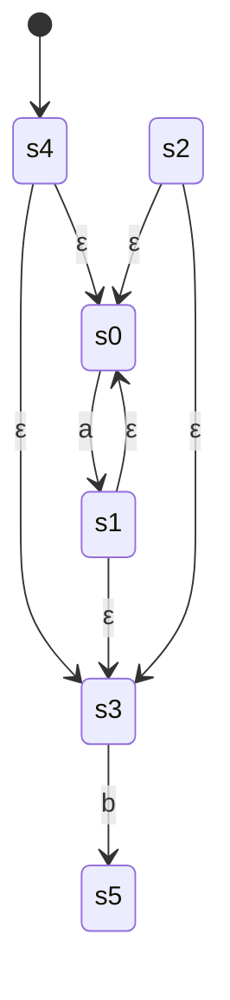
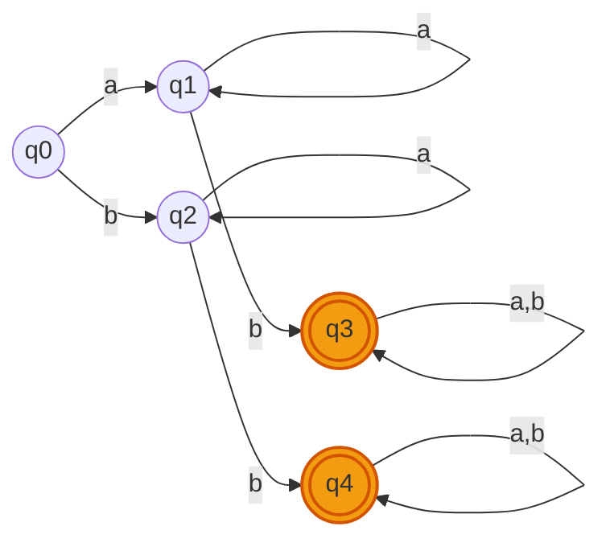
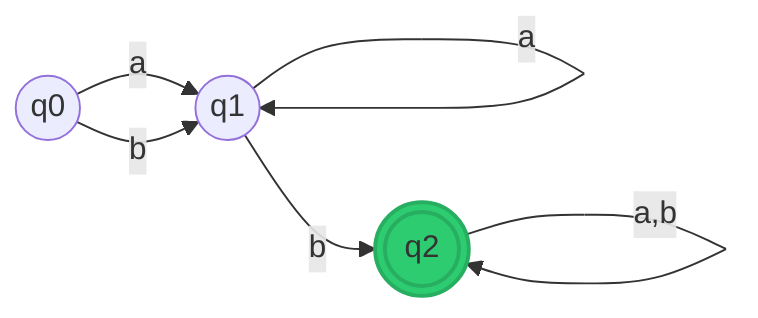

# Laporan Proyek Teori Bahasa dan Automata (TBA)
## Aplikasi Smart Automata Simulator

Laporan ini menyajikan struktur dokumentasi formal, penjelasan implementasi kode program, serta contoh masukan (input) dan luaran (output) dari empat fitur utama yang diimplementasikan pada aplikasi **Smart Automata Simulator**.

---

## DAFTAR ISI
1. [Arsitektur Aplikasi & Pemetaan Berkas](#arsitektur-aplikasi--pemetaan-berkas)
2. [Fitur 1: Uji String pada Deterministic Finite Automata (DFA)](#fitur-1-uji-string-pada-deterministic-finite-automata-dfa)
3. [Fitur 2: Konversi Regular Expression ke NFA (Konstruksi Thompson) & Uji String](#fitur-2-konversi-regular-expression-ke-nfa-konstruksi-thompson--uji-string)
4. [Fitur 3: Minimisasi DFA (Partition Refinement)](#fitur-3-minimisasi-dfa-partition-refinement)
5. [Fitur 4: Cek Ekuivalensi Dua DFA (Product Construction + BFS)](#fitur-4-cek-ekuivalensi-dua-dfa-product-construction--bfs)
6. [Helper Sistem & Tema Visual](#helper-sistem--tema-visual)

---

## Arsitektur Aplikasi & Pemetaan Berkas

Aplikasi **Smart Automata Simulator** dibangun dengan arsitektur modular yang memisahkan logika matematika komputasi automata dari logika penyajian antarmuka pengguna (UI). Berikut adalah pemetaan berkas penting dalam proyek ini:



### Daftar Berkas Utama & Letak Kodenya:
1. **[main.py](file:///d:/Nia/Kuliah/SEM4/TBA/main.py)**: Berkas utama (entry point) aplikasi Streamlit. Berfungsi mengatur tata letak halaman, memuat tema CSS, dan mengarahkan rute halaman ke fitur yang dipilih melalui sidebar.
2. **[engine.py](file:///d:/Nia/Kuliah/SEM4/TBA/engine.py)**: Mengandung kelas komputasi inti:
   - `DFA`: Eksekusi & pelacakan *string* pada DFA.
   - `NFA`: Eksekusi parallel-tracking & $\varepsilon$-closure pada NFA.
   - `RegexParser`: Pembaca ekspresi reguler menjadi Abstract Syntax Tree (AST) dan mengonversinya ke NFA dengan aturan Thompson.
   - `minimize_dfa`: Algoritma penyederhanaan state DFA (Partition Refinement).
   - `dfa_equivalent`: Pengujian ekuivalensi fungsional dua DFA dengan BFS.
3. **[utils.py](file:///d:/Nia/Kuliah/SEM4/TBA/utils.py)**: Berkas helper visualisasi. Mengonversi data struktur automata Python menjadi kode Graphviz DOT, men-generate gambar SVG, dan menyuntikkan class CSS kustom ke tag SVG agar state aktif dapat dianimasikan secara dinamis.
4. **[styles.py](file:///d:/Nia/Kuliah/SEM4/TBA/styles.py)**: Menyimpan definisi warna palet kustom (dark mode premium) dan aturan-aturan animasi CSS `@keyframes` yang membuat state automata bersinar (*glowing*).
5. **[dfa_testing.py](file:///d:/Nia/Kuliah/SEM4/TBA/dfa_testing.py)**: Pengendali antarmuka Fitur 1 (Formulir DFA, pemrosesan transisi, dan eksekusi visualisasi berkecepatan dinamis).
6. **[regex_nfa.py](file:///d:/Nia/Kuliah/SEM4/TBA/regex_nfa.py)**: Pengendali antarmuka Fitur 2 (Form input regex, penampilan transisi NFA, dan penjejakan parallel states).
7. **[dfa_minimization.py](file:///d:/Nia/Kuliah/SEM4/TBA/dfa_minimization.py)**: Pengendali antarmuka Fitur 3 (Visualisasi perbandingan side-by-side graf DFA asli vs minimal, dan metrik reduksi).
8. **[dfa_equivalence.py](file:///d:/Nia/Kuliah/SEM4/TBA/dfa_equivalence.py)**: Pengendali antarmuka Fitur 4 (Formulir input dua DFA, status ekuivalensi, dan penelusuran string pembeda).

---

## Fitur 1: Uji String pada Deterministic Finite Automata (DFA)

### 1.1 Deskripsi & Teori
Fitur ini memvalidasi apakah sebuah string masukan diterima atau ditolak oleh mesin DFA yang didefinisikan oleh pengguna. Mesin menelusuri transisi secara sekuensial karakter demi karakter mulai dari *start state*.

### 1.2 Format Masukan (Input)
*   **States**: `q0, q1, q2`
*   **Alfabet**: `0, 1`
*   **Start State**: `q0`
*   **Accepting States**: `q2`
*   **Tabel Transisi**:
    ```text
    q0, 0, q0
    q0, 1, q1
    q1, 0, q2
    q1, 1, q0
    q2, 0, q1
    q2, 1, q2
    ```
*   **String Uji**: `010`

### 1.3 Representasi Graf Automata


### 1.4 Hasil Luaran (Output)
*   **Status**: `✅ DITERIMA (Accepted)`
*   **Lintasan State (Trace)**:
    $$\text{Start } (q0) \xrightarrow{0} q0 \xrightarrow{1} q1 \xrightarrow{0} q2 \quad (\text{Accepting State})$$
*   **Log Simulasi**:
    | Langkah | Karakter Dibaca | State Aktif | Sisa String |
    | :--- | :---: | :---: | :---: |
    | 0 | — | `q0` | `010` |
    | 1 | `0` | `q0` | `10` |
    | 2 | `1` | `q1` | `0` |
    | 3 | `0` | `q2` | (selesai) |

### 1.5 Implementasi Kode
Logika pemrosesan DFA diimplementasikan pada fungsi `validate_dfa` dan kelas `DFA` dalam file **[engine.py](file:///d:/Nia/Kuliah/SEM4/TBA/engine.py#L18-L119)**:

```python
class DFA:
    def __init__(self, states, alphabet, transitions, start, accepts):
        self.states = set(states)
        self.alphabet = set(alphabet)
        self.transitions = dict(transitions)
        self.start = start
        self.accepts = set(accepts)
        self.incomplete_transitions = validate_dfa(
            self.states, self.alphabet, self.transitions, self.start, self.accepts
        )

    def run(self, string):
        current = self.start
        trace = [current]
        for ch in string:
            if ch not in self.alphabet:
                return False, trace
            key = (current, ch)
            if key not in self.transitions:
                return False, trace
            current = self.transitions[key]
            trace.append(current)
        return (current in self.accepts), trace
```
**Penjelasan Kode:**
1.  **Konstruktor (`__init__`)**: Menyimpan komponen DFA berupa himpunan state (`states`), alfabet (`alphabet`), fungsi transisi (`transitions` dalam bentuk dictionary Python dengan kunci `(state, simbol)`), start state, dan himpunan accepting states.
2.  **Pencocokan String (`run`)**: Dimulai dari `self.start` sebagai state aktif. Untuk setiap karakter dalam string, dicocokkan dengan dictionary `self.transitions`. Jika transisi valid, state aktif diperbarui dan ditambahkan ke dalam `trace` untuk kebutuhan visualisasi lintasan pada frontend. Jika di akhir pembacaan string, state aktif berada di `accepts`, maka fungsi mengembalikan nilai `True`.
3.  **Validasi & DFA Parsial (`validate_dfa`)**: Dipanggil otomatis di dalam konstruktor. Melempar `ValueError` jika ditemukan inkonsistensi fatal (state/alfabet kosong, start/accepting state tidak terdaftar, transisi merujuk state atau simbol yang tidak dikenal). Selain itu, fungsi ini juga melakukan pengecekan lunak (*non-fatal*): pasangan `(state, simbol)` yang transisinya belum didefinisikan dikumpulkan ke `self.incomplete_transitions` dan ditampilkan sebagai peringatan "DFA tidak total" di UI — pasangan tersebut diperlakukan sebagai penolakan implisit (menuju *trap state*) saat `run()` maupun `dfa_equivalent()` dijalankan.

### 1.6 Implementasi Antarmuka (Streamlit UI)
Seluruh logika UI dan animasi langkah-demi-langkah (step-by-step) untuk pengujian DFA terletak di berkas **[dfa_testing.py](file:///d:/Nia/Kuliah/SEM4/TBA/dfa_testing.py#L14-L151)**:
- **`parse_transitions_dfa(text)`**: Menguraikan baris teks input transisi pengguna (misal: `q0, 0, q0`) menjadi dictionary Python.
- **`render()`**: Menggambar tata letak formulir untuk menerima states, alfabet, start state, accepting states, dan transisi DFA.
- **Animasi Sinkron (`time.sleep`)**: Ketika tombol "Jalankan" diklik, aplikasi melakukan iterasi sepanjang array `trace`. Di setiap langkah, ia memperbarui penyorotan state (`highlight_state`) dan edge (`highlight_edge`) dengan memanggil helper `render_dfa_animated()`. Kontainer kosong (`st.empty()`) diganti secara dinamis untuk memberikan efek pergerakan mulus pada browser.

---

## Fitur 2: Konversi Regular Expression ke NFA (Konstruksi Thompson) & Uji String

### 2.1 Deskripsi & Teori
Fitur ini mengonversi Ekspresi Reguler (Regex) menjadi *Nondeterministic Finite Automata with $\varepsilon$-transitions* ($\varepsilon$-NFA) menggunakan **Konstruksi Thompson**, kemudian mensimulasikan string masukan pada NFA secara paralel menggunakan konsep **$\varepsilon$-closure**.

#### A. Definisi Formal $\varepsilon$-NFA
Secara formal, $\varepsilon$-NFA didefinisikan sebagai 5-tuple:
$$M = (Q, \Sigma, \delta, q_0, F)$$
Di mana:
*   $Q$ adalah himpunan terhingga dari state.
*   $\Sigma$ adalah alfabet (simbol masukan).
*   $\delta$ adalah fungsi transisi yang memetakan state dan simbol masukan (termasuk $\varepsilon$) ke himpunan state tujuan:
    $$\delta: Q \times (\Sigma \cup \{\varepsilon\}) \rightarrow 2^Q$$
*   $q_0 \in Q$ adalah start state (state awal).
*   $F \subseteq Q$ adalah himpunan accepting states (state penerima).

#### B. Operasi $\varepsilon$-closure (Penutupan Epsilon)
$\varepsilon$-closure dari sebuah state $s$ (atau himpunan state $S$) adalah himpunan seluruh state yang dapat dicapai melalui transisi $\varepsilon$ secara berantai tanpa membaca simbol masukan apapun. Secara induktif didefinisikan sebagai:
1. **Basis**: 
   $$s \in \varepsilon\text{-closure}(\{s\})$$
2. **Langkah Induksi**: Jika $p \in \varepsilon\text{-closure}(\{s\})$ dan $r \in \delta(p, \varepsilon)$, maka:
   $$r \in \varepsilon\text{-closure}(\{s\})$$

Untuk himpunan state $S \subseteq Q$, penutupan epsilon didefinisikan sebagai:
$$\varepsilon\text{-closure}(S) = \bigcup_{s \in S} \varepsilon\text{-closure}(\{s\})$$

#### C. Simulasi Paralel NFA (Fungsi Transisi Diperluas $\hat{\delta}$)
Dalam simulasi pembacaan string $w \in \Sigma^*$ pada NFA, fungsi transisi diperluas $\hat{\delta}$ didefinisikan secara rekursif:
1. **Basis (String kosong $\varepsilon$)**:
   $$\hat{\delta}(q_0, \varepsilon) = \varepsilon\text{-closure}(\{q_0\})$$
2. **Langkah Rekursif (Untuk string $w = xa$ di mana $x \in \Sigma^*$ dan $a \in \Sigma$)**:
   $$\hat{\delta}(q_0, xa) = \varepsilon\text{-closure}\left( \bigcup_{p \in \hat{\delta}(q_0, x)} \delta(p, a) \right)$$

String $w$ dinyatakan **DITERIMA** oleh NFA jika dan hanya jika hasil transisi diperluas dari state awal mengandung setidaknya satu state penerima:
$$\hat{\delta}(q_0, w) \cap F \neq \emptyset$$

---

### 2.2 Format Masukan (Input)
*   **Regular Expression**: `a*b`
*   **String Uji**: `aab`

### 2.3 Hasil Pembangkitan NFA (Konstruksi Thompson)
Berdasarkan AST dari ekspresi `a*b`, NFA yang di-generate memiliki struktur sebagai berikut:



### 2.4 Hasil Luaran (Output)
*   **Spesifikasi Mesin NFA**:
    *   **States ($Q$)**: `['s0', 's1', 's2', 's3', 's4', 's5']`
    *   **Start State ($q_0$)**: `s4`
    *   **Accepting State ($F$)**: `s5`
*   **Status Pengujian**: `✅ DITERIMA (Accepted)`
*   **Trace Himpunan State (Parallel Tracking)**:
    Untuk string uji $w = \text{"aab"}$, berikut adalah pelacakan state aktif secara paralel:

    | Langkah ($k$) | Karakter Dibaca ($a$) | Himpunan State Aktif ($\hat{\delta}(q_0, x)$) | Deskripsi / Perhitungan |
    | :---: | :---: | :--- | :--- |
    | 0 | — | `['s0', 's1', 's3', 's4']` | $\hat{\delta}(q_0, \varepsilon) = \varepsilon\text{-closure}(\{s_4\}) = \{s_0, s_1, s_3, s_4\}$ |
    | 1 | `a` | `['s0', 's1', 's3']` | $\varepsilon\text{-closure}(\delta(\{s_0, s_1, s_3, s_4\}, a)) = \varepsilon\text{-closure}(\{s_1\}) = \{s_0, s_1, s_3\}$ |
    | 2 | `a` | `['s0', 's1', 's3']` | $\varepsilon\text{-closure}(\delta(\{s_0, s_1, s_3\}, a)) = \varepsilon\text{-closure}(\{s_1\}) = \{s_0, s_1, s_3\}$ |
    | 3 | `b` | `['s5']` | $\varepsilon\text{-closure}(\delta(\{s_0, s_1, s_3\}, b)) = \varepsilon\text{-closure}(\{s_5\}) = \{s_5\}$ |

    Karena $\hat{\delta}(s_4, \text{"aab"}) \cap F = \{s_5\} \cap \{s_5\} = \{s_5\} \neq \emptyset$, string **DITERIMA**.

### 2.5 Implementasi Kode
Parser regex dan konstruksi NFA Thompson diimplementasikan melalui kelas `RegexParser` dan `NFA` di file **[engine.py](file:///d:/Nia/Kuliah/SEM4/TBA/engine.py#L126-L320)**:

#### A. Konstruksi Thompson (`RegexParser` & `to_nfa`)
```python
def build(node):
    kind = node[0]
    if kind == 'symbol':
        s, t = self.new_state(), self.new_state()
        add_trans(s, node[1], t)
        return s, t
    elif kind == 'epsilon':
        s, t = self.new_state(), self.new_state()
        add_trans(s, EPSILON, t)
        return s, t
    elif kind == 'concat':
        s1, t1 = build(node[1])
        s2, t2 = build(node[2])
        add_trans(t1, EPSILON, s2)
        return s1, t2
    elif kind == 'union':
        s1, t1 = build(node[1])
        s2, t2 = build(node[2])
        s, t = self.new_state(), self.new_state()
        add_trans(s, EPSILON, s1)
        add_trans(s, EPSILON, s2)
        add_trans(t1, EPSILON, t)
        add_trans(t2, EPSILON, t)
        return s, t
    elif kind == 'star':
        s1, t1 = build(node[1])
        s, t = self.new_state(), self.new_state()
        add_trans(s, EPSILON, s1)
        add_trans(t1, EPSILON, t)
        add_trans(s, EPSILON, t)
        add_trans(t1, EPSILON, s1)
        return s, t
    elif kind == 'plus':
        s1, t1 = build(node[1])
        s, t = self.new_state(), self.new_state()
        add_trans(s, EPSILON, s1)
        add_trans(t1, EPSILON, t)
        add_trans(t1, EPSILON, s1)
        return s, t
    elif kind == 'optional':
        s1, t1 = build(node[1])
        s, t = self.new_state(), self.new_state()
        add_trans(s, EPSILON, s1)
        add_trans(t1, EPSILON, t)
        add_trans(s, EPSILON, t)
        return s, t
```

**Penjelasan Konstruksi (Thompson's Rules):**
Fungsi `build(node)` membaca AST hasil parsing regex secara rekursif dan membangun sub-NFA berdasarkan kaidah Thompson:
1.  **Symbol (`symbol`)**: Membuat dua state baru ($s, t$) dan membuat satu transisi bertanda simbol $a \in \Sigma$ dari $s \rightarrow t$:
    $$\delta(s, a) = \{t\}$$
2.  **Epsilon (`epsilon`)**: Membuat dua state baru ($s, t$) dan menghubungkannya dengan transisi $\varepsilon$:
    $$\delta(s, \varepsilon) = \{t\}$$
3.  **Concatenation (`concat`)**: Menyambungkan state akhir sub-NFA pertama ($t_1$) dengan state awal sub-NFA kedua ($s_2$) via transisi $\varepsilon$:
    $$\delta(t_1, \varepsilon) = \{s_2\}$$
4.  **Union (`union`)**: Membuat start state baru $s$ dan end state baru $t$. State $s$ dihubungkan ke $s_1$ dan $s_2$ dengan $\varepsilon$, dan state akhir $t_1$ serta $t_2$ dihubungkan ke $t$ dengan $\varepsilon$:
    $$\delta(s, \varepsilon) = \{s_1, s_2\}, \quad \delta(t_1, \varepsilon) = \{t\}, \quad \delta(t_2, \varepsilon) = \{t\}$$
5.  **Kleene Star (`star`)**: Membuat start state baru $s$ dan end state baru $t$. Menambahkan loop kembali dari $t_1 \rightarrow s_1$ dan jalur bypass langsung dari $s \rightarrow t$ (boleh muncul nol kali):
    $$\delta(s, \varepsilon) = \{s_1, t\}, \quad \delta(t_1, \varepsilon) = \{s_1, t\}$$
6.  **Plus (`plus`, operator `+`)**: Sama seperti Kleene Star, tapi *tanpa* jalur bypass langsung dari $s \rightarrow t$ — sub-ekspresi wajib muncul minimal satu kali sebelum boleh diulang:
    $$\delta(s, \varepsilon) = \{s_1\}, \quad \delta(t_1, \varepsilon) = \{s_1, t\}$$
7.  **Optional (`optional`, operator `?`)**: Sama seperti Kleene Star, tapi *tanpa* loop balik $t_1 \rightarrow s_1$ — sub-ekspresi boleh muncul nol kali atau tepat satu kali, tidak bisa diulang:
    $$\delta(s, \varepsilon) = \{s_1, t\}, \quad \delta(t_1, \varepsilon) = \{t\}$$

#### B. Simulasi NFA (`NFA`)
```python
class NFA:
    # ... init ...
    def epsilon_closure(self, states):
        stack = list(states)
        closure = set(states)
        while stack:
            s = stack.pop()
            for t in self.transitions.get((s, EPSILON), set()):
                if t not in closure:
                    closure.add(t)
                    stack.append(t)
        return frozenset(closure)

    def run(self, string):
        current = self.epsilon_closure({self.start})
        trace = [current]
        for ch in string:
            nxt = set()
            for s in current:
                for t in self.transitions.get((s, ch), set()):
                    nxt.add(t)
            current = self.epsilon_closure(nxt)
            trace.append(current)
            if not current:
                return False, trace
        accepted = any(s in self.accepts for s in current)
        return accepted, trace
```

**Penjelasan Simulasi:**
1.  **`epsilon_closure`**: Menghitung penutupan epsilon secara iteratif dengan penelusuran DFS (menggunakan *stack*). Algoritma menambahkan setiap state tetangga yang terhubung lewat transisi $\varepsilon$ ke dalam set penutupan hingga tidak ada lagi state baru yang dapat dijangkau.
2.  **`run`**: Menelusuri string dengan melacak kumpulan state aktif secara paralel. Setiap membaca simbol baru, program mencari semua state tujuan dari seluruh state aktif saat ini, kemudian menghitung penutupan epsilon (`epsilon_closure`) dari himpunan state baru tersebut. Hasil pengujian bernilai benar jika $\hat{\delta}(q_0, w) \cap F \neq \emptyset$.

### 2.6 Implementasi Antarmuka (Streamlit UI)
Logika antarmuka pengolahan ekspresi reguler dan visualisasi NFA Thompson didefinisikan pada berkas **[regex_nfa.py](file:///d:/Nia/Kuliah/SEM4/TBA/regex_nfa.py#L14-L180)**:
- **`render()`**: Menerima input pola regex dari pengguna dan memanggil fungsi `regex_to_nfa` dari `engine.py`.
- **Ekspansi Detail**: Menampilkan tabel transisi lengkap dari NFA yang digenerate dengan penulisan representasi transisi epsilon $\varepsilon$ yang rapi.
- **Visualisasi Parallel-Tracking**: Karena NFA dapat berada di beberapa state sekaligus, antarmuka melacak himpunan state aktif (`active_states`) pada setiap iterasi pembacaan string dan meng-highlight semua state aktif tersebut di dalam graf SVG dengan `render_nfa_animated()`.

---

## Fitur 3: Minimisasi DFA (Partition Refinement)

### 3.1 Deskripsi & Teori
Mereduksi jumlah state pada DFA bertujuan untuk menghasilkan mesin automata minimal (paling efisien) yang tetap menerima bahasa yang **persis sama** dengan DFA asli. Minimisasi DFA didasarkan pada konsep **ekuivalensi state** (Teorema Myhill-Nerode).

Dua buah state $p$ dan $q$ dikatakan **ekuivalen** (ditulis $p \equiv q$) jika dan hanya jika untuk setiap string masukan $w \in \Sigma^*$, transisi dari kedua state tersebut berakhir pada status penerimaan yang sama:
$$\delta^*(p, w) \in F \iff \delta^*(q, w) \in F$$

Jika terdapat suatu string $w$ sedemikian rupa sehingga salah satu state berakhir di accepting state sedangkan state lainnya berakhir di non-accepting state, maka kedua state tersebut dikatakan **dapat dibedakan** (*distinguishable*):
$$\exists w \in \Sigma^* \quad \text{s.t.} \quad (\delta^*(p, w) \in F \land \delta^*(q, w) \notin F) \lor (\delta^*(p, w) \notin F \land \delta^*(q, w) \in F)$$

Algoritma **Partition Refinement** bekerja dengan membagi himpunan seluruh state $Q$ menjadi kelompok-kelompok partisi yang saling lepas (*disjoint blocks*):
1. **Partisi Awal ($P_0$)**: Membagi seluruh state yang *reachable* berdasarkan kriteria penerimaan awal:
   $$P_0 = \{F, Q \setminus F\}$$
   di mana $F$ adalah himpunan accepting states dan $Q \setminus F$ adalah himpunan non-accepting states.
2. **Iterasi Penghalusan (Refinement) ($P_{k} \rightarrow P_{k+1}$)**: Dua buah state $p$ dan $q$ yang berada pada kelompok yang sama di $P_k$ akan tetap berada pada kelompok yang sama di $P_{k+1}$ jika dan hanya jika untuk setiap simbol alfabet $a \in \Sigma$, transisi mereka mengarah ke kelompok yang sama pada partisi $P_k$:
   $$\forall a \in \Sigma, \quad [\delta(p, a)]_{P_k} = [\delta(q, a)]_{P_k}$$
   di mana $[s]_{P_k}$ menyatakan kelompok dalam partisi $P_k$ yang mengandung state $s$. Jika kondisi ini tidak dipenuhi, kelompok tersebut harus dipecah (*split*).
3. **Kondisi Berhenti**: Iterasi dihentikan ketika partisi sudah stabil, yaitu ketika tidak ada lagi kelompok yang terpecah pada iterasi berikutnya:
   $$P_{k+1} = P_k$$

### 3.2 Format Masukan (Input)
*   **States**: `q0, q1, q2, q3, q4`
*   **Alfabet**: `a, b`
*   **Start State**: `q0`
*   **Accepting States**: `q3, q4`
*   **Tabel Transisi**:
    ```text
    q0, a, q1
    q0, b, q2
    q1, a, q1
    q1, b, q3
    q2, a, q2
    q2, b, q4
    q3, a, q3
    q3, b, q3
    q4, a, q4
    q4, b, q4
    ```

### 3.3 Proses Partisi (Refinement)
Berikut adalah simulasi matematis pembagian partisi untuk DFA contoh di atas:

1. **Partisi Awal ($P_0$)**:
   Membagi state menjadi kelompok accepting ($G_1$) dan non-accepting ($G_2$):
   $$G_1 = \{q_3, q_4\}, \quad G_2 = \{q_0, q_1, q_2\}$$
   $$P_0 = \{G_1, G_2\}$$

2. **Iterasi 1 ($P_1$)**:
   Uji setiap state di masing-masing kelompok berdasarkan ke kelompok mana transisinya mengarah untuk alfabet $\Sigma = \{a, b\}$.
   
   * **Menguji Kelompok $G_1 = \{q_3, q_4\}$**:
     * Untuk $q_3$:
       $$\delta(q_3, a) = q_3 \in G_1 \quad \text{dan} \quad \delta(q_3, b) = q_3 \in G_1 \implies \text{Signature}(q_3) = (G_1, G_1)$$
     * Untuk $q_4$:
       $$\delta(q_4, a) = q_4 \in G_1 \quad \text{dan} \delta(q_4, b) = q_4 \in G_1 \implies \text{Signature}(q_4) = (G_1, G_1)$$
     * Karena tanda tangan (*signature*) $q_3$ dan $q_4$ sama, $G_1$ **tidak pecah**.

   * **Menguji Kelompok $G_2 = \{q_0, q_1, q_2\}$**:
     * Untuk $q_0$:
       $$\delta(q_0, a) = q_1 \in G_2 \quad \text{dan} \quad \delta(q_0, b) = q_2 \in G_2 \implies \text{Signature}(q_0) = (G_2, G_2)$$
     * Untuk $q_1$:
       $$\delta(q_1, a) = q_1 \in G_2 \quad \text{dan} \quad \delta(q_1, b) = q_3 \in G_1 \implies \text{Signature}(q_1) = (G_2, G_1)$$
     * Untuk $q_2$:
       $$\delta(q_2, a) = q_2 \in G_2 \quad \text{dan} \quad \delta(q_2, b) = q_4 \in G_1 \implies \text{Signature}(q_2) = (G_2, G_1)$$
     * Karena tanda tangan $q_0$ berbeda dengan $q_1$ dan $q_2$, kelompok $G_2$ terpecah menjadi dua kelompok baru:
       $$G_{2a} = \{q_0\} \quad \text{dan} \quad G_{2b} = \{q_1, q_2\}$$

   Hasil Partisi Iterasi 1:
   $$P_1 = \{\{q_3, q_4\}, \{q_0\}, \{q_1, q_2\}\}$$

3. **Iterasi 2 ($P_2$)**:
   Uji kembali kelompok-kelompok yang tersisa di $P_1$:
   * Kelompok $\{q_0\}$ hanya memiliki 1 state, sehingga tidak dapat dipecah lagi.
   * Kelompok $\{q_3, q_4\}$ dan $\{q_1, q_2\}$ jika diuji transisinya terhadap partisi $P_1$ menghasilkan tanda tangan yang homogen untuk masing-masing anggotanya.
   * Karena tidak ada kelompok yang pecah lagi pada iterasi ini, algoritma berhenti ($P_2 = P_1$).

4. **Partisi Akhir ($P_{\text{final}}$)**:
   $$P_{\text{final}} = \{\{q_0\}, \{q_1, q_2\}, \{q_3, q_4\}\}$$
   Himpunan state tereduksi diwakili oleh perwakilan setiap kelompok, menghasilkan 3 state baru.

### 3.4 Perbandingan Graf Automata

```carousel

<!-- slide -->

```

### 3.5 Hasil Luaran (Output)
*   **Metrik Reduksi**:
    *   Jumlah State Awal: `5`
    *   Jumlah State Minimal: `3`
    *   Pengurangan: `2 State`
*   **Definisi DFA Minimal**:
    *   **States**: `['q0', 'q1', 'q2']` (dimana `q1` mewakili `{q1, q2}` dan `q2` mewakili `{q3, q4}`)
    *   **Start State**: `q0`
    *   **Accepting State**: `q2`
    *   **Transisi DFA Minimal**:
        ```text
        (q0, a) -> q1
        (q0, b) -> q1
        (q1, a) -> q1
        (q1, b) -> q2
        (q2, a) -> q2
        (q2, b) -> q2
        ```

### 3.6 Implementasi Kode
Algoritma minimisasi diimplementasikan dalam fungsi `minimize_dfa` (dibungkus kelas hasil `MinimizationResult`) pada file **[engine.py](file:///d:/Nia/Kuliah/SEM4/TBA/engine.py#L347-L470)**:

```python
class MinimizationResult(DFA):
    """Subclass DFA — semua atribut/method DFA biasa tetap tersedia,
    ditambah field informasional: unreachable_states, partition_steps,
    state_mapping."""
    def __init__(self, states, alphabet, transitions, start, accepts,
                unreachable_states, partition_steps, state_mapping):
        super().__init__(states, alphabet, transitions, start, accepts)
        self.unreachable_states = unreachable_states
        self.partition_steps = partition_steps
        self.state_mapping = state_mapping


def minimize_dfa(dfa: DFA):
    states = sorted(dfa.states)
    alphabet = sorted(dfa.alphabet)

    # 1. Hapus state yang tidak reachable
    reachable = {dfa.start}
    frontier = [dfa.start]
    while frontier:
        s = frontier.pop()
        for a in alphabet:
            t = dfa.transitions.get((s, a))
            if t is not None and t not in reachable:
                reachable.add(t)
                frontier.append(t)
    unreachable_states = sorted(s for s in states if s not in reachable)
    states = [s for s in states if s in reachable]

    # 2. Partisi awal: accepting vs non-accepting
    accept_set = frozenset(s for s in states if s in dfa.accepts)
    nonaccept_set = frozenset(s for s in states if s not in dfa.accepts)
    partitions = [p for p in [accept_set, nonaccept_set] if p]

    def find_group(state, groups):
        for g in groups:
            if state in g:
                return g
        return None

    def snapshot(label, groups):
        return {"label": label, "groups": [sorted(g) for g in groups]}

    partition_steps = [snapshot("P0", partitions)]

    # 3. Refinement loop
    changed = True
    iteration = 1
    while changed:
        changed = False
        new_partitions = []
        for group in partitions:
            splitter = {}
            for s in sorted(group):          # urutan deterministik
                signature = tuple(
                    find_group(dfa.transitions.get((s, a)), partitions)
                    for a in alphabet
                )
                splitter.setdefault(signature, set()).add(s)

            if len(splitter) == 1:
                new_partitions.append(group)
            else:
                changed = True
                for sub in splitter.values():
                    new_partitions.append(frozenset(sub))
        partitions = new_partitions
        if changed:
            partition_steps.append(snapshot(f"P{iteration}", partitions))
            iteration += 1

    # 4. Bangun DFA baru berdasarkan kelompok partisi
    group_name = {g: f"q{i}" for i, g in enumerate(partitions)}
    state_mapping = {name: sorted(g) for g, name in group_name.items()}
    # ... penyusunan transisi baru ...
    return MinimizationResult(
        set(group_name.values()), dfa.alphabet, new_transitions, new_start, new_accepts,
        unreachable_states=unreachable_states,
        partition_steps=partition_steps,
        state_mapping=state_mapping,
    )
```
**Penjelasan Kode:**
1.  **Langkah 1**: Menghilangkan state yang tidak dapat dicapai dari start state menggunakan algoritma BFS sederhana. State yang dibuang dicatat ke `unreachable_states` agar bisa ditampilkan sebagai peringatan di UI.
2.  **Langkah 2**: Membagi state-state reachable menjadi dua partisi utama: accepting vs non-accepting.
3.  **Langkah 3**: Loop pembagian (refinement) menggunakan tanda tangan transisi (`signature`). Tanda tangan ini merepresentasikan ke kelompok mana suatu state berpindah untuk setiap simbol input. Jika state-state dalam satu kelompok memiliki tanda tangan yang berbeda, kelompok tersebut dipecah. Tiap kelompok diiterasi dalam urutan terurut (`sorted(group)`) supaya penamaan state baru (`q0, q1, ...`) konsisten di setiap kali dijalankan — sebelumnya urutan ini bergantung pada urutan iterasi `frozenset` Python yang tidak deterministik antar proses.
4.  **Langkah 4**: Mengonversi setiap kelompok partisi akhir yang stabil menjadi state minimal baru dan menyusun ulang tabel transisi.
5.  **Hasil sebagai `MinimizationResult`**: Selain DFA minimal itu sendiri (tetap bisa dipakai persis seperti objek `DFA` biasa), fungsi ini juga mengembalikan tiga informasi tambahan murni untuk keperluan visualisasi di UI: `unreachable_states` (state yang dibuang di Langkah 1), `partition_steps` (snapshot kelompok partisi $P_0, P_1, \dots$ di setiap iterasi refinement), dan `state_mapping` (pemetaan nama state baru ke anggota state lama). Ketiganya ditampilkan masing-masing pada expander "Langkah Partisi" dan "Pemetaan State" di `dfa_minimization.py`.

### 3.7 Implementasi Antarmuka (Streamlit UI)
Tata letak untuk menampilkan proses minimisasi DFA diatur dalam berkas **[dfa_minimization.py](file:///d:/Nia/Kuliah/SEM4/TBA/dfa_minimization.py#L12-L175)**:
- **Penyajian Metrik (`st.metric`)**: Menyediakan panel ringkasan informasi berupa jumlah state awal, jumlah state minimal setelah pemrosesan, dan persentase/jumlah pengurangan state.
- **Visualisasi Komparatif**: Menampilkan graf DFA Asli dan DFA Minimal secara berdampingan (side-by-side) menggunakan layout kolom (`st.columns`) dan `st.graphviz_chart()` untuk memudahkan analisis pengguna.
- **Detail Proses**: Expander "Langkah Partisi" menampilkan tiap iterasi $P_0, P_1, \dots$ dari `partition_steps`, dan expander "Pemetaan State" menampilkan tabel `state_mapping` (status "digabung" jika satu state baru mewakili lebih dari satu state lama, "tetap" jika tidak). Jika ada state yang tidak *reachable*, ditampilkan sebagai peringatan terpisah.
- **Uji Konsistensi**: Menyediakan simulator kecil di bagian bawah halaman untuk langsung menguji string pada hasil DFA minimal guna memastikan bahwa perilakunya tetap konsisten dengan mesin aslinya.


---

## Fitur 4: Cek Ekuivalensi Dua DFA (Product Construction + BFS)

### 4.1 Deskripsi & Teori
Menentukan apakah dua DFA menerima bahasa yang **persis sama** menggunakan **Product Construction (Cross-Product)** yang ditelusuri dengan pencarian melebar (**BFS**). Jika ditemukan pasangan state $(s_1, s_2)$ di mana salah satunya menerima sedangkan yang lain menolak, maka kedua DFA dinyatakan tidak ekuivalen dan string tersebut dikembalikan sebagai bukti (*Distinguishing String*).

### 4.2 Format Masukan (Input)

#### DFA 1
*   **States**: `q0, q1`
*   **Alfabet**: `a, b`
*   **Start**: `q0`
*   **Accepting**: `q1`
*   **Transisi DFA 1**:
    ```text
    q0, a, q1
    q0, b, q0
    q1, a, q1
    q1, b, q0
    ```

#### DFA 2
*   **States**: `p0, p1, p2`
*   **Alfabet**: `a, b`
*   **Start**: `p0`
*   **Accepting**: `p1, p2`
*   **Transisi DFA 2**:
    ```text
    p0, a, p1
    p0, b, p0
    p1, a, p2
    p1, b, p0
    p2, a, p2
    p2, b, p0
    ```

### 4.3 Hasil Luaran (Output)
*   **Status Ekuivalensi**: `✅ EKUIVALEN (Equivalent)`
*   **Analisis**:
    Kedua DFA menerima bahasa yang direpresentasikan oleh regular expression `(a|b)*a`, yaitu seluruh string yang **berakhir dengan simbol 'a'**. Pada DFA 1, simbol 'a' selalu membawa state ke `q1` (accepting) dan simbol 'b' selalu membawa kembali ke `q0` (non-accepting), sehingga status akhir hanya ditentukan oleh simbol terakhir yang dibaca. Pola yang sama berlaku pada DFA 2: `p1` dan `p2` sama-sama accepting dan sama-sama kembali ke `p0` saat membaca 'b', sehingga keduanya berperilaku ekuivalen terhadap `q1`. Karena setiap pasangan state yang dapat dicapai dari $(q_0, p_0)$ selalu memiliki sifat penerimaan yang setara (misalnya $(q_1, p_1)$ dan $(q_1, p_2)$ keduanya bernilai *True* untuk penerimaan), maka kedua mesin tersebut terbukti ekuivalen secara fungsional.

### 4.4 Implementasi Kode
Algoritma pemeriksaan ekuivalensi diimplementasikan dalam fungsi `dfa_equivalent` pada file **[engine.py](file:///d:/Nia/Kuliah/SEM4/TBA/engine.py#L477-L518)**:

```python
def dfa_equivalent(dfa1: DFA, dfa2: DFA):
    alphabet = sorted(dfa1.alphabet | dfa2.alphabet)
    DEAD = "__DEAD__"

    def step(dfa, state, symbol):
        if state == DEAD:
            return DEAD
        return dfa.transitions.get((state, symbol), DEAD)

    def is_accept(dfa, state):
        return state != DEAD and state in dfa.accepts

    queue = [(dfa1.start, dfa2.start, "")]
    visited = {(dfa1.start, dfa2.start)}
    explored_pairs = []

    while queue:
        s1, s2, path = queue.pop(0)
        explored_pairs.append((s1, s2))
        # Jika satu state bernilai accept dan pasangannya tidak, maka TIDAK EKUIVALEN
        if is_accept(dfa1, s1) != is_accept(dfa2, s2):
            return False, (path if path != "" else "(string kosong / epsilon)"), explored_pairs
        
        for sym in alphabet:
            n1 = step(dfa1, s1, sym)
            n2 = step(dfa2, s2, sym)
            pair = (n1, n2)
            if pair not in visited:
                visited.add(pair)
                queue.append((n1, n2, path + sym))

    return True, None, explored_pairs
```
**Penjelasan Kode:**
1.  **Product States & BFS**: Algoritma memeriksa pasangan state gabungan `(s1, s2)` mulai dari start state kedua DFA. Penelusuran menggunakan struktur BFS untuk menemukan string pembeda terpendek.
2.  **State Mati (`DEAD`)**: Ditambahkan untuk menangani kasus di mana transisi tidak didefinisikan secara lengkap pada DFA masukan (DFA parsial), sehingga transisinya mengarah ke state perangkap virtual.
3.  **Pendeteksian Perbedaan**: Jika di suatu pasangan state `(s1, s2)` yang dicapai oleh lintasan `path` memiliki status penerimaan berbeda (`is_accept` bernilai `True` pada satu DFA dan `False` pada DFA lainnya), fungsi langsung berhenti dan mengembalikan string pembeda tersebut. Jika antrean kosong tanpa menemukan perbedaan, kedua DFA terbukti ekuivalen.
4.  **Pencatatan `explored_pairs`**: Setiap pasangan state yang diambil dari antrean dicatat ke `explored_pairs`, murni untuk keperluan visualisasi — tidak memengaruhi hasil `True`/`False` maupun isi *distinguishing string*. Daftar ini dipakai UI untuk menandai baris mana pada "Product Construction Table" yang benar-benar *reachable* dari $(q_0, p_0)$ via BFS, dibanding pasangan yang secara teoritis mungkin tapi tidak pernah tercapai.

### 4.5 Implementasi Antarmuka (Streamlit UI)
Logika antarmuka pengujian ekuivalensi dua DFA terletak pada berkas **[dfa_equivalence.py](file:///d:/Nia/Kuliah/SEM4/TBA/dfa_equivalence.py#L26-L215)**:
- **`input_dfa_form`**: Sub-fungsi dinamis untuk menampilkan form input spesifikasi automata (states, alfabet, start state, accepting states, transisi) secara modular baik untuk DFA 1 maupun DFA 2.
- **Product Construction Table**: Jika kedua DFA terbukti ekuivalen, expander ini menampilkan seluruh pasangan state $(q, p) \in Q_1 \times Q_2$ beserta status *reachable*-nya (berdasarkan `explored_pairs`), status accept masing-masing, dan tujuan transisi tiap simbol — sebagai bukti visual bahwa BFS sudah menjelajahi seluruh pasangan yang relevan tanpa menemukan perbedaan.
- **Penyajian String Pembeda**: Apabila kedua DFA tidak ekuivalen, program mengeksekusi string pembeda tersebut pada kedua DFA secara paralel, meng-highlight lintasan dan state terakhirnya masing-masing, kemudian menampilkan status akhir (Accept/Reject) untuk menunjukkan secara visual di mana letak perbedaan penerimaan bahasa keduanya.

---

## Helper Sistem & Tema Visual

Selain berkas fitur utama, simulator ini dilengkapi dengan infrastruktur visualisasi dan tema kustom:

### 1. Visualisasi Graf & Animasi SVG ([utils.py](file:///d:/Nia/Kuliah/SEM4/TBA/utils.py))
Modul helper ini menangani konversi automata Python ke Graphviz SVG:
- **`build_dfa_graph(dfa)`** & **`build_nfa_graph(nfa)`**: Membangun visualisasi terarah (*directed graph*) dari data transisi. State penerima akan otomatis digambar dengan lingkaran ganda (*double circle*).
- **`_inject_animations(svg_str, highlight_states, accepted)`**: Melakukan pemindaian regex pada kode XML SVG mentah yang dihasilkan oleh Graphviz untuk menyuntikkan kelas CSS kustom (`state-active`, `state-accepted`, atau `state-rejected`) pada node yang sedang aktif selama pengujian string.
- **`render_dfa_animated()`** & **`render_nfa_animated()`**: Wrapper utama untuk menggabungkan kode SVG dengan kontainer HTML kustom agar bisa ditampilkan dalam Streamlit menggunakan `components.html()`.

### 2. Desain & Animasi Keyframes ([styles.py](file:///d:/Nia/Kuliah/SEM4/TBA/styles.py))
Mendefinisikan gaya premium aplikasi:
- **Tema Warna**: Palet warna gelap modern dengan zinc background kustom (`#09090b`), aksen cyan (`#06b6d4`), kuning amber (`#f59e0b`), emerald green (`#10b981`), dan rose red (`#f43f5e`).
- **CSS Keyframes (`ANIM_CSS`)**:
  - `glow-active`: Animasi pulsasi berpendar jingga-kuning pada state yang sedang ditelusuri.
  - `glow-accept`: Efek pendaran hijau bernapas pada state penerima di akhir pembacaan string yang berhasil.
  - `glow-reject`: Efek pendaran kedip merah berulang pada state penolakan apabila string ditolak.
  - `scale-breathe`: Efek perbesaran teks state untuk efek interaktif.
- **Global Theme Override (`THEME_CSS`)**: Menyuntikkan CSS global untuk memodifikasi komponen Streamlit seperti font (Outfit untuk header, JetBrains Mono untuk input/code, Plus Jakarta Sans untuk paragraf), gradien background aplikasi, serta gaya interaktif tombol hover kustom.

---
